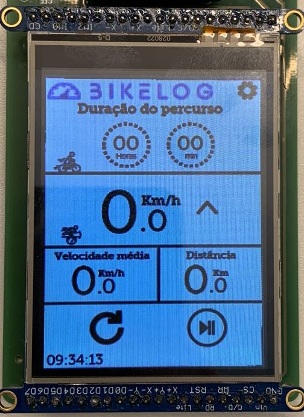
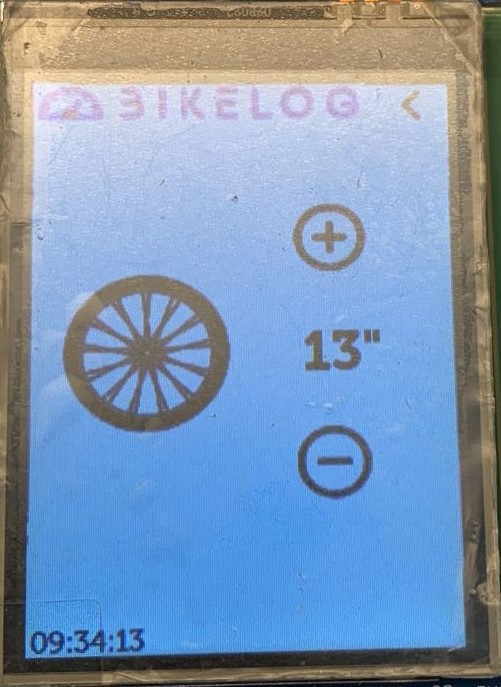

# 21b - APS2 - Embarcados

O marketing de uma empresa de equipamentos esportivos quer criar um novo ciclocomputador e você foi escolhido como desenvolvedor autônomo, dado seu background técnico e de UX, para criar um protótipo e validar a ideia.

Mais detalhes no site da disciplina:

- https://insper.github.io/ComputacaoEmbarcada/navigation/APS/APS-2-Bike/Descricao/

## Detalhes

Integrantes:

- Pedro Henrique Britto Aragão Andrade
- Giancarlo Vanoni Ruggiero
- Thiago Shiguero Kawahara

Nome da marca:

- BikeLog

## Interface

### Proposta UX 1 - C

> - Mockup da interface:
>    - Os widgets do LVGL são:
>      - Image button (lv_imgbtn)
>      - Line (lv_line)
>      - Image (lv_img)
>      - Text area (lv_textarea)
>      
>    ### Prototipo de imagem antes da primeira entrevista
>    #### Imagem da tela principal
>
>    
>
>    #### Imagem da configuração
>
>    
>
> ### Link do Vídeo explicando a interface
> 

### Proposta UX 2 - B

>   Utilizamos a fonte **Museo Slab** (tamanho 9) por ter traços pequenos (para descrever pequenos detalhes), mas ainda robustos e simplórios, o ideal para uma leitura >   fácil em movimento.
>
>   ### Link do aúdio da entrevista com o Luiz do Fablab:
>
>   https://drive.google.com/file/d/1dwIE1LQ-4tXilP4EJjmqmhTcEnlkvI2K/view?usp=share_link
>
>   ### Prototipo de imagem depois da primeira entrevista
>   #### Imagem da tela principal
>
>   
>
>   #### Imagem da configuração
>
>   

> ### Link do vídeo explicando as alterações
>
> ### Detalhes da segunda interação da proposta de interface:
>
> Para a tela principal não houve nenhuma alteração recomendada, porém na tela de configuração do aro da roda houve algumas alterações, como por exemplo
> adicionar uma opção para alterar o tamanho do pneu, além disso por um dropdown ao invés de por um botão que aumente o aro/pneu e adicionar um botão que > o ciclista vai escolher se o valor do tamanho é em polegadas ou em milímetros.

### Proposta UX 3 - A

> Utilizamos a **cor de fundo branco** para não só dar um grande contraste com a **escrita em preto**, como também para não chamar muita atenção e distrair o ciclista. > Para diferenciar, os **botões estão em azul** para combinar com o logo, e como vão ser usados apenas em segundo plano (quando o ciclista estiver parado), não é necessário um grande contraste. 
>
> - Pega feedback com mais uma pessoa externa e incorpora na interface
>     - Grava em vídeo a entrevista
> - Grava um vídeo atualizado explicando o que foi sugerido e o que fizeram para melhorar a interface
> - Apresentar uma foto da interface sendo executada no LCD (imagem estática)
>
> Detalhes da terceira interação da proposta de interface:
>
<!-- 
 Adicionar texto descrevendo a evolução 
 da interface
-->

- Vídeo 
